# How to make a static webpage and install NGINX
Created by: Jack Tam A00930311 and Jose Bangate A01271709
#### Step 1: Sudo users
Ensure you have a user with sudo privileges
<br><br/>

#### Step 2: Install NGINX
Check for updates with the ```sudo apt update ``` command.
Then install NGINX with ``` sudo apt install nginx``` command.
###### You will be prompted to confirm. Type ```y``` and press enter.
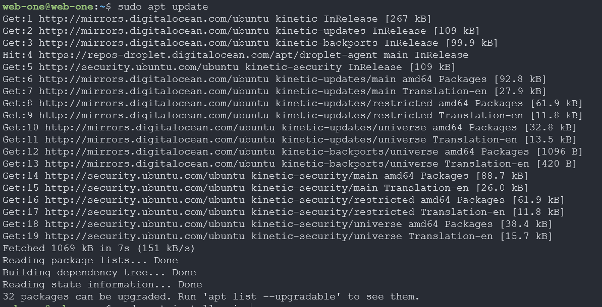

###### Succesful installation will look like this
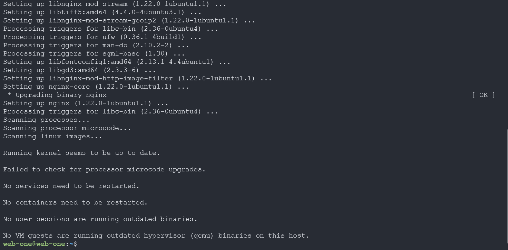
<br></br>

### Step 3: Create an NGINX server block to serve the HTML document
NGINX server blocks are created in ```/etc/nginx/sites-available/```
Use the command ```sudo vim /etc/nginx/sites-available/<filename>``` to create a new server block. Here we used ip address as the filename.
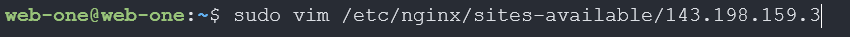
Next, add the following lines of code to the newly created file. 
##### Ensure you replace the ${droplet_ip_address} with your droplet's IP address.
```
server {
        listen 80;
        listen [::]:80;

       root /var/www/143.198.159.3/html;
        index index.html;

        server_name 143.198.159.3;

        location / {
                try_files $uri $uri/ =404;
        }
}
```
Example of completed file
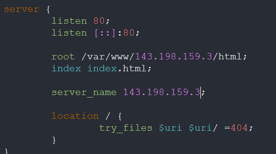
<br><br/>

### Step 4: Placing the HTML document
First need to make a directory in ```/var/www/``` with the IP of the droplet and also create a html directory within that directory. 
This can be achieved with 1 command ```sudo mkdir -p /var/www/${droplet_ip_address}/html```
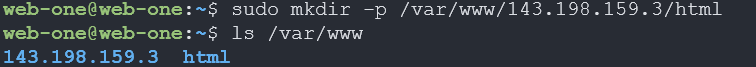
Create an index.html document using ```sudo vim /var/www/${droplet_ip_address}/html/index.html```
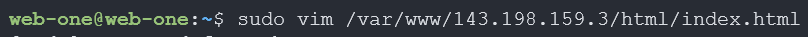
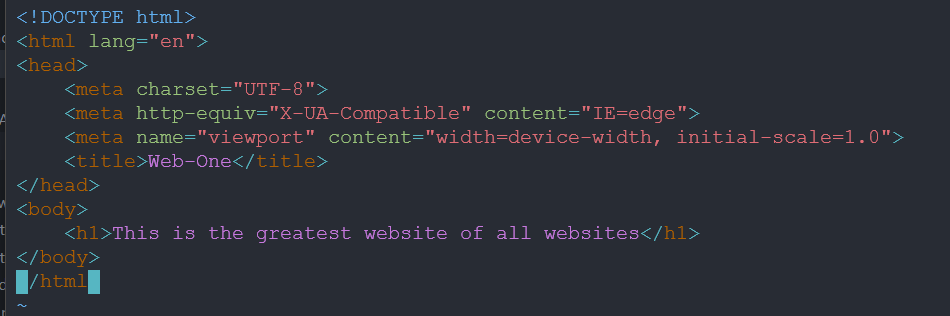
<br><br/>

### Step 5: Creating a soft link
Create a soft link to the new server block with ```sudo ln -s /etc/nginx/sites-available/${IP} /etc/nginx/sites-enabled/``` command.
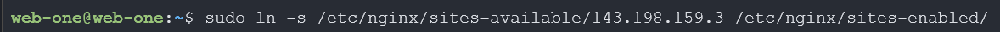
<br><br/>

### Step 6: Test NGINX and restart NGINX
You can test the NGINX with ```sudo nginx -t``` command.
You can restart NGINX with ```sudo systemctl restart nginx``` command.
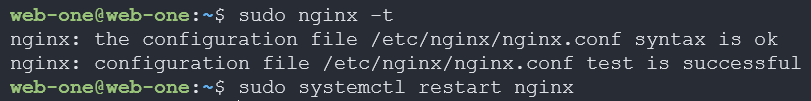
You can als confirm that the site is working by typing in the droplet IP address into a web browser
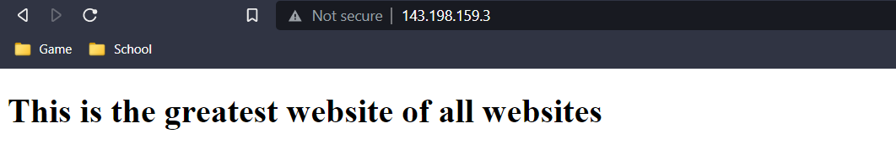
<br><br/>

### Step 7: Setting up a firewall
Check if ufw is active with ```sudo ufw status```
It should be inactive for now
Use ```sudo ufw app list``` to see a list of available applications that can be used with ufw.
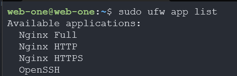
Allow OpenSSH and Nginx HTTP with commands ```sudo ufw allow OpenSSH``` and ```sudo ufw allow "Nginx HTTP"```
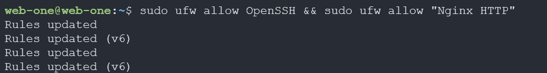
Enable the firewall with ```sudo ufw enable```
Press ```y``` to confirm
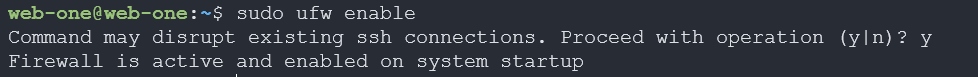
Check the status of the firewall with ```sudo ufw status```
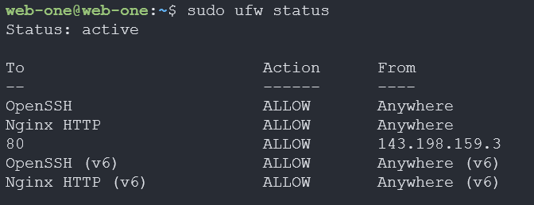
Test the firewall by typing in the droplet IP address into a web browser again. You should still be able to access the webpage without issue

<br><br/>

# Congratulations! You have successfully created a static webpage and installed NGINX